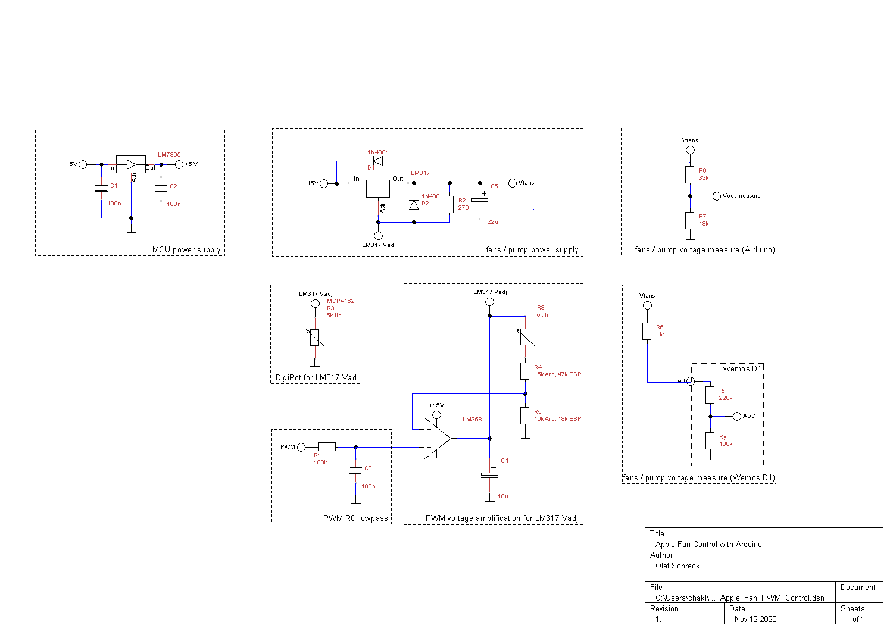

## Project Goal

...

## Apple G5 Case

...

## Apple G5 Fans

...

## Microcontroller

Initially, we designed the system to use standard Arduino boards (Arduino Uno, Nano or Pro Mini with ATmega328 processor). It might work with limited functionality on the smaller ATTiny boards, we did not test this yet. It should work with minor adjustments on bigger Arduino boards such as Arduino Mega, but these boards would probably be overkill for the task at hand. Untested because we don't have these boards.

After some redesign we wanted to support WiFi, so the system could interface to home automation systems or be controlled by a mobile app. The obvious choice was using a board from the ESP8266 family, which include WiFi hardware. We used an ESP-12 board (Wemos D1, similar boards such as NodeMCU should work as well). The small ESP-01 boards might work with limited functionality, we did not test this yet. It should work with minor adjustments on bigger ESP32 boards as well, but that would probably be overkill either.

Another variant is to run the main code on an Arduino board, with WiFi functionality offloaded to a connected ESP-01. We did not test this yet.

### Functionality provided by Microcontroller

The software running on the MCU shall provide the following functionality:

* control rear fans speed (voltage)
  * using either PWM or digital potentiometer
  * read/report fan voltage
* control water pump (voltage)
  * using either PWM or digital potentiometer
  * read/report pump voltage
* read/report/warn on water tank low/high
* read/report temperature and humidity
  * DHT22 sensor (alternatives: AM2320, SI7021, BME280)
* drive status LED(s) or multicolor status LED
* provide a simple HTTP server to report status and change fan speed
* for debugging, support serial console output and commands
* support OTA (over-the-air) software updates

## Circuit

### Power Supply

The Apple fans that we want to control are voltage controlled, fan speed can be between "none" (< 2.5V) and "max" (~ 12.5V). We will use an LM317 voltage regulator, which has a drop-ot voltage of 2.5V. So in order to provide full 12V to the fans, the system needs to run at 15V Vcc.

We use an old notebook power supply providing 15V DC 4 Amp, which is more than enough for the project.

### MCU Power Supply

We use a 7805 fixed voltage regulator to provide 5V Vcc to the microcontroller. Arduinos need 5V, while most ESP boards can be powered by 5V, even though they use 3.3V internally.

We use a low-power 78L05 for this, as we don't expect the MCU to draw more than 100mA. Capacitors C1, C2 use recommended values from the datasheet on both Vin/Vout sides.

### Fan Power Supply

We drive the fan voltage (and thus fan speed) using a LM317 adjustable voltage regulator. The Vin capacitor is actually C1 from the MCU power supply, while the Vout capacitor C5 uses a value recommended in the datasheet. Resistor R2 should be 240 Ohm 1% tolerance according to the LM317 datasheet. We did not have that value in our toolbox and used 270 Ohm instead (there are sample circuits on the Internet that even use 330 or 470 Ohm, which might work but possibly break the spec of the chip).

D1 and D2 are optional protection diodes that protect the LM317 against short-circuits on both Vin and Vout sides.

### Fan Voltage Control by PWM

#### RC Lowpass

R1=100k and C3=100n build a lowpass to turn the PWM signal from the MCU into a (more or less) constant voltage. In reality, there remains a ripple voltage on the lowpass output that gets amplified and *might* lead to noticeable oscillations of fan speed.

The cut-off frequency of the lowpass is calculated as (1 / 2pi RC). With the specified values, the cut-off frequency is around 16 Hz, which leaves some ripple voltage on the output when the MCU drives the PWM signal at its default PWM frequency (Arduino: 490 Hz, ESP8266: 1 kHz).

Ripple on the fan speed control voltage turned out to be irrelevant for the brushless DC fans we are using. There were no noticable oscillations of fan rotation.

Ripple could be reduced further by lowering the cut-off frequency. Which means increasing R and/or C. We don't want to use elkos here, so C won't go much higher. We are hesitating to go higher with R as well. We could build a 2nd order RC lowpass by simply adding another resistor and capacitor, using the same R and C values.

Probably not worth the effort, as it can be improved in software by increasing the PWM frequency to >30 kHz, so the RC lowpass will be more efficient.

#### OpAmp

The LM358 OpAmp is needed to amplify the PWM voltage after the RC lowpass to voltage levels required to drive the LM317.

With 15V Vcc and LM317 2.5V dropoff, we can get 12.5V Vout max. To get this Vout, we need to supply 11.25V to the LM317 Vadj pin. This should correspond to 100% PWM.

An Arduino powered from USB provides ~4.7V DC after the RC lowpass at 100% PWM. An ESP8266 uses 3.3V internally and provides ~3.2V after the RC lowpass at 100% PWM. A non-inverting OpAmp is used to amplify these voltage levels to 11.25V LM317 Vadj.

Amplification is controlled by the values of the (R3+R4)/R5 voltage divider. In our experiments, we used a fix value for R4 in series with a 5k trimmer pot to find the sweet spot.

Resistor values for Arduino: R5=10k, R4=15k, R3=0-5k; sweet spot R3+R4=18k.

Resistor values for ESP: R5=18k, R4=47k, R3=0-5k; sweet spot R3+R4=Xk.

### Fan Voltage Control by Digital Potentiometer

An alternative way to control fan voltage is to use a digital potentiometer rather than PWM to drive LM317 Vadj. The output voltage Vfans is controlled by the voltage divider R2/R3, which resembles example applications in the LM317 datasheet. This a has a few advantages:
* the circuit will be simpler with less component parts
* ripple is not an issue as there is no pulsed PWM signal
* not using PWM puts less strain on the MCU

It also has a major disadvantage: it is way more expensive. We payed around 4.50€ for the MCP4162, while the OpAmp, resitors and capacitors needed for PWM cost around 0.50€ altogether. So this is merely an academic exercise.

One important thing to check is that the current through the digipot does not exceed the maximum value specified in the digipot's datasheet, otherwise the unit will get destroyed. A MCP4162 digipot allows a maximum current of 2.5mA through its "resistor" pins. According to LM317 datasheet, the maximum current flowing out of the ADJ pin to GND through the digipot will be <0.1mA, so we should be safe.

### Fan Voltage Measurement

Voltages can be measured with a MCU using analog input pin in combination with a voltage divider. Input voltage on analog pins must not exceed certain limits, so the voltage divider "scales" down the output voltage to be measured to acceptable values.

Details vary between Arduino and ESP8266 boards:

Arduinos have 4 analog input pins that can accept max 5V. For max 12.5V output voltage, good resistor values would be R6=33k / R7=22k. We chose R7=18k for some safety margin, so we can measure up to 14.1V without risk of damaging the Arduino analog input ports.

ESP8266-12 MCUs have only one analog input pin that can accept max 1V, while the small ESP8266-01 MCUs have no analog input pin at all. Various boards use the ESP8266-12 MCU and have an integrated 220k/100k voltage divider that would allow up to 3.2V on the boards analog input. For these boards, only a single resistor needs to provided, which adds to the internal voltage divider. With a 1M resistor we can measure up to 13.2V  without risk of damaging the ESP analog input port.

### Water Pump Power Supply and Water Pump Voltage Measurement

We have a brushless DC water pump that can be driven with 3.5V to 9V power supply. We use the same circuit as above for the water pump power supply. Rather recalculating the (R3+R4)/R5 voltage divider to limit the maximum output voltage to 9V, we use the same resistor values as for 12.5V output and will limit max output voltage in software.

### Water Tank Level Sensor

[...]

### Environment Sensor

The environment sensor is not shown in the schematics because it does not need electronic components (only Vcc, GND and connection to a MCU digital pin).

We considered DHT11, DHT22, AM2320, SI7021 and BME280 environmental sensors. We choose to use a DHT22 for the following reasons:
* unlike SI7021 and BME280, it has a plastic cover (sensor will be mounted outside the case)
* unlike AM2320, the plastic cover has a nose with a mounting hole which helps mechanical fitting
* unlike DHT11, it is sufficiently precise

The sensor will be mounted 30-50cm away from the MCU board. It needs 3 lines for signal, Vcc and GND, so we chose shielded stereo audio cable for the connection.

## Software

### Supported Boards

The Arduino sketch is designed to support Arduino boards with ATmega328 CPU (Uno, Nano, Mini Pro) and ESP8266 boards (ESP8266-12, Wemos D1 mini, NodeMCU or similar). Further boards might be added. The software tries to auto-detect the board that it is running on.

### Components and Configuration

The software is designed to be modular. Configuration settings are defined by C preprocessor defines in the config section. Various components can be deconfigured by commenting out `#define WITH_*` lines. Config settings not starting with `WITH_` can be left at the defaults, they get ignored if their corresponding `WITH_` settings are commented out.

The code is heavily #ifdef'd in order to keep to resulting code small by not compiling deconfigured stuff.

#### WITH_REAR_FANS and WITH_REAR_FANS_VOLTAGE

`WITH_REAR_FANS` allows to control the rear fans from the MCU, which is the main project goal anyway. Might be disabled for testing purposes. `WITH_REAR_FANS_VOLTAGE` allows to measure fan voltage and report it by HTTP or serial console if configured.

#### WITH_WATER_PUMP and WITH_WATER_PUMP_VOLTAGE

`WITH_WATER_PUMP` allows to control water pump power from the MCU. Might be disabled for testing purposes. `WITH_WATER_PUMP_VOLTAGE` allows to measure water pump voltage and report it by HTTP or serial console if configured. Note that ESP8266 provide only one analog input, so either fans or pump voltage can be monitored.

#### WITH_REAR_ENV_SENSOR

This defines that an environmental sensor is mounted on the back of the unit. An environmental sensor reads and reports at least temperature und humidity data. Currently supported sensors are DHT22, possibly supported sensors might be AM2320, SI7021 or BMEx80. If configured, the sensor will report data by HTTP or serial console if these channels are enabled.

#### WITH_SERIAL and WITH_SERIAL_COMMANDS

`WITH_SERIAL` is useful for debugging with the MCU attached to an IDE. It will print startup messages and periodical sensor value data to the serial console. In production use without a permanently connected serial console, it should be commented out, because it will claim runtime memory for string operations that are never consumed. Similarily, it should be disabled if WITH_OTA is used (because there is no serial console on OTA).
`WITH_SERIAL_COMMANDS` allows to actively inject commands from the serial console, rather than just passively reporting status. It requires `WITH_SERIAL` and is ignored otherwise.

#### WITH_ESP8266_WIFI

`WITH_ESP8266_WIFI` will be defined automatically if WiFi capable hardware is detected. Comment out to explicitly disable WiFi.

#### WITH_HTTPSRV

`WITH_HTTPSRV` controls whether the device provides an HTTP server. It is ignored if `WITH_WIFI` is not defined. Comment out to explicitly disable HTTP server.

#### WITH_OTA

`WITH_OTA` supports over-the-air updates of the code running on the MCU. It is ignored if `WITH_WIFI` is not defined. Comment out to explicitly disable OTA updates. When using `WITH_OTA`, you should disable `WITH_SERIAL`, as there is no usable serial line.

#### WITH_HIGH_PWMFREQ

This increases the PWM frequency from 490 Hz to 31372.55 Hz (Arduino), or from 1 kHz to 32 kHz (ESP8266). This is recommended when using PWM for rear fans or pump voltage control, because it reduces the possibility of interference with other sensors or libraries (we noticed a DHT22 reporting bad values when low PWM frequencies were used).

## References

* G5 pinouts: https://kettek.net/articles/powermac-g5-to-atx-pinouts
* G5 fan wiring: https://www.insanelymac.com/forum/topic/86729-wiring-for-g5-fans/
* Helpful for G5 fan pinouts (rest is misleading): https://www.rellimmot.com/how-to/Mac-Fan-Pinouts/
* Details on G5 fans: https://www.tonymacx86.com/threads/info-on-g5-fans.69889/
* More details on G5 fans (posts #12 and #16): https://www.tonymacx86.com/threads/macpro-fan-pinout.122584/page-2

* PWM to DC voltage: https://www.edn.com/control-an-lm317t-with-a-pwm-signal/
* PWM to DC voltage: https://electronics.stackexchange.com/questions/17852/how-does-this-power-supply-circuit-work-mcu-lm317
* PWM to DC voltage (post #14): https://forum.arduino.cc/index.php?topic=459003.0
* Details on LM317 (german): https://praktische-elektronik.dr-k.de/Bauelemente/Be-LM317.html

* Arduino Nano pinouts; https://www.circuitstoday.com/arduino-nano-tutorial-pinout-schematics
* ESP8266 pinouts and pin usage: https://randomnerdtutorials.com/esp8266-pinout-reference-gpios/
* Wemos D1 mini pinouts and schematics: https://escapequotes.net/esp8266-wemos-d1-mini-pins-and-diagram/
* Pinouts and details about various ESP8266 boards (german): http://stefanfrings.de/esp8266/

* Nice voltage divider calculator: https://ohmslawcalculator.com/voltage-divider-calculator

* Voltage measurement: https://startingelectronics.org/articles/arduino/measuring-voltage-with-arduino/#:~:text=Arduino%20analog%20inputs%20can%20be,to%20create%20a%20voltage%20divider.

* MCP4162: https://tronixstuff.com/category/mcp4162/
* MCP4162: https://github.com/phanrahan/arduino/tree/master/MCP4162https://github.com/phanrahan/arduino/tree/master/MCP4162
